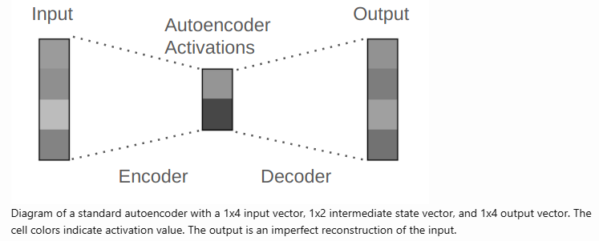

# 原文翻译
sparse autoencoders的思想来源于sparse dictionary learning，用来理解黑盒模型内部的工作原理

使用SAE，我们能够将一个模型的计算分解为可理解的部分

一个神经网络中最自然的组成部分即是一个独立的神经元，但很不幸，一个神经元往往不会直接对应一个概念，事实上，神经网络中的一个概念往往是由多个神经元来表示的，而一个神经元往往也会涉及到多个概念的表示，这也被称作 superposition 其背后的理解在于，对于一个知识，比如某个名人的出生地，这个知识只来自于数据集中的百万分之一训练tokens，但模型在学习这个知识的同时需要学习很多其他的知识。

当前SAEs已经成为了理解神经网络的重要工具

首先来说autoencoder，如下图所示，一个标准的autoencoder是一个神经网络用来压缩再重建输入。举个例子，（100， 50， 100）表示一个autoencoder接收一个100维的向量作为输入，encoder部分将其压缩为一个50维的向量，再将压缩后的50维向量作为decoder的输入来重建原始的100维向量



## 稀释自编码器 SAE
SAE通常将输入向量转换成一个中间向量，这个中间向量的维度可以比原始向量维度更高、相当或者更低。 将SAE运用到解释LLM的中间激活值时，中间向量的维度往往是大于输入向量维度的。

所谓稀疏，是说，转换得到的中间向量中大多数分量都是0值

关于SAE的训练，当没有其他约束的时候，压缩重建这个任务对于SAE模型而言就是很简单的。 SAE模型将直接使用单位矩阵完成向量变换。

因而我们在训练SAE的时候往往会采取额外的约束条件来保证稀疏中间向量的产生。举个例子，我们可能会将一个100维向量转换成一个200维的中间向量，而其中只有大约20个非零元素


针对LLM，这里以GPT-3为例，GPT-3有96层，在前向传播过程中，每个token都对应一个12288维的向量。这个向量聚合了模型用来预测该token的全部信息。如果我们使用SAE来理解GPT-3中的中间激活，SAE的模型架构将为encoder matrix -> ReLU activation -> decoder matrix，举个例子，如果这里SAE的expansion factor为4，则encoder matrix为(12288, 49512)， 中间向量维度为(49512)，decoder matrix为（49512， 12288）。通常来说，SAE的稀疏程度会达到，49512维向量中仅有大约100个 非零元素。

SAE的训练是跟LLM中间激活的选取位置紧密相关的，如果需要分析模型不同层的中间激活，我们通常需要训练很多个SAE，一个位置对应一个SAE

SAE模型结构代码示例
```python
import torch
import torch.nn as nn

class SparseAutoEncoder(nn.Module):
    """
    A one-layer autoencoder
    """
    def __init__(self, activation_dim: int, dict_size: int):
        super().__init__()
        self.activation_dim = activation_dim
        self.dict_size = dict_size

        self.encoder_DF = nn.Linear(activation_dim, dict_dim, bias=True)
        self.decoder_FD = nn.Linear(dict_dim, activation_dim, bias=True)
    
    def encode(self, model_activations_D: torch.Tensor) -> torch.Tensor:
        return nn.ReLU()(self.encoder_DF(model_activations_D))
    
    def decode(self, encoded_representation_F: torch.Tensor) -> torch.Tensor:
        return self.decoder_FD(encoded_representation_F)
    
    def foward_pass(self, model_activations_D: torch.Tensor) -> tuple[torch.Tensor, torch.Tensor]:
        encoded_representation_F = self.encode(model_activations_D)
        reconstructed_model_activations_D = self.decode(encoded_representation_F)
        return reconstructed_activations_D, encoded_representation_F
```

SAE模型训练的损失函数是输入向量的重建准确性，同时为了引入稀疏性，通常还会在损失函数中引入一个稀疏惩罚损失，该项通常用SAE中间表示的L1损失再乘以一个L1系数

需要注意的是：SAE的优化目标并非向量可解释性本身，其可解释的性质是模型在重建输入向量和保持中间表示稀疏性的副产品

```python
# B = batch size, D = d_model, F = dictionary_size

def calculate_loss(autoencoder: SparseAutoEncoder, model_activations_BD: torch.Tensor, l1_coefficient: float) -> torch.Tensor:
    reconstructed_model_activations_BD, encoded_representation_BF = autoencoder.forward_pass(model_activations_BD)
    reconstruction_error_BD = (reconstructed_model_activations_BD - model_activations_BD).pow(2)
    reconstruction_error_B = einops.reduce(reconstruction_error_BD, 'B D -> B', 'sum')
    l2_loss = reconstruction_error_B.mean()

    l1_loss = l1_coefficient * encoded_representation_BF.sum()
    loss = l2_loss + l1_loss
    return loss
```
## BatchTopK SAE
[Scaling and evaluating sparse autoencoders](https://openreview.net/forum?id=tcsZt9ZNKD)

参考实现：[batch_top_k.py](https://github.com/saprmarks/dictionary_learning/blob/main/trainers/batch_top_k.py)


# 参考资料
[An Intuitive Explanation of Sparse Autoencoders for LLM Interpretability](https://adamkarvonen.github.io/machine_learning/2024/06/11/sae-intuitions.html)